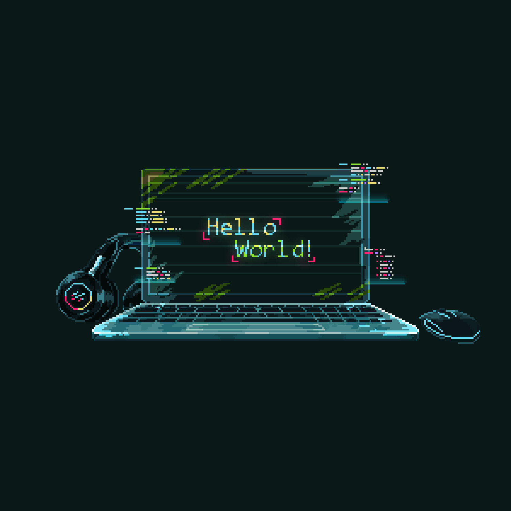

<h1 align="center">
  Hi, I'm Mona Hassan 
</h1>

<h3 align="center">
  
</h3>

## 👩‍💻 About Me

  

 

🧩 Dedicated Frontend Developer with a strong interest in creating clean, responsive, and interactive user interfaces that provide great user experiences.

🎓 Computer Science & Information Technology Graduate from the Egyptian E-Learning University (2024).

🚀 Completed the Digital Egypt Pioneers Initiative (DEPI) Full Stack .NET Training.

💻 Passionate about building modern, responsive, and user-friendly web applications.

🌱 Currently improving my skills in Frontend Development, Full Stack Development, and Software Engineering.

🤝 Eager to collaborate on impactful projects and contribute to innovative development teams.

 

## 🛠️ Tech Stack

<table>
    <tr>
        <td style="font-weight: bold; padding-right: 10px; vertical-align: center; border: none;">Frontend:</td>
        <td></td>
    </tr>
    <tr>
        <td style="font-weight: bold; padding-right: 10px; vertical-align: center;">Backend:</td>
        <td></td>
    </tr>
    <tr>
        <td style="font-weight: bold; padding-right: 10px; vertical-align: center; border: none;">Database:</td>
        <td></td>
    </tr>
    <tr>
        <td style="font-weight: bold; padding-right: 10px; vertical-align: center; border: none;">Automated test:</td>
        <td></td>
    </tr>
    <tr>
        <td style="font-weight: bold; padding-right: 10px; vertical-align: center; border: none;">Version Control:</td>
        <td></td>
    </tr>
    <tr>
        <td style="font-weight: bold; padding-right: 10px; vertical-align: center; border: none;">Tools:</td>
        <td></td>
    </tr>
</table>

## 📊 GitHub Stats

  <!-- TOP ROW: STATS + LANGUAGES -->
  <table>
    <tr>
      <td>
        
      </td>
      <td>
        
      </td>
    </tr>
  </table>

  <!-- STREAK UNDER THEM -->
   

  

## 📫 Connect With Me

  

  

  

✨ Code • Learn • Build • Repeat ✨

